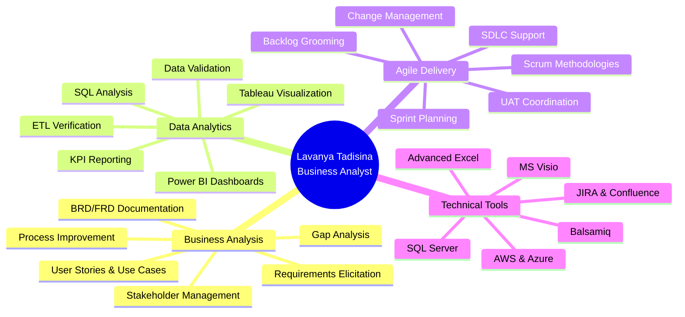
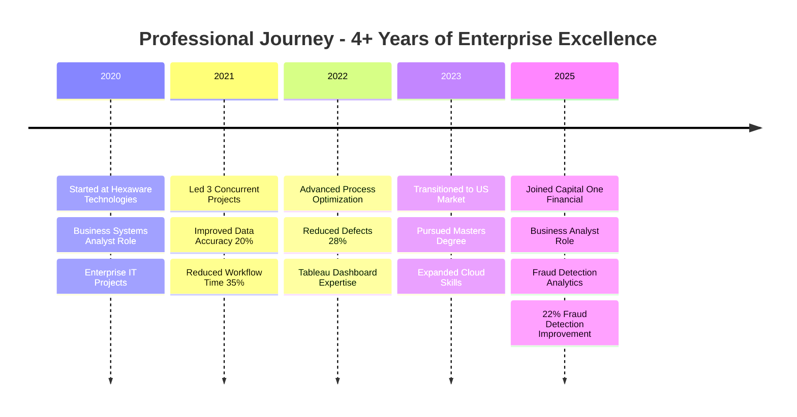

<!-- 
████████╗ █████╗ ██████╗ ██╗███████╗██╗███╗   ██╗ █████╗     ██╗      █████╗ ██╗   ██╗ █████╗ ███╗   ██╗██╗   ██╗ █████╗ 
╚══██╔══╝██╔══██╗██╔══██╗██║██╔════╝██║████╗  ██║██╔══██╗    ██║     ██╔══██╗██║   ██║██╔══██╗████╗  ██║╚██╗ ██╔╝██╔══██╗
   ██║   ███████║██║  ██║██║███████╗██║██╔██╗ ██║███████║    ██║     ███████║██║   ██║███████║██╔██╗ ██║ ╚████╔╝ ███████║
   ██║   ██╔══██║██║  ██║██║╚════██║██║██║╚██╗██║██╔══██║    ██║     ██╔══██║╚██╗ ██╔╝██╔══██║██║╚██╗██║  ╚██╔╝  ██╔══██║
   ██║   ██║  ██║██████╔╝██║███████║██║██║ ╚████║██║  ██║    ███████╗██║  ██║ ╚████╔╝ ██║  ██║██║ ╚████║   ██║   ██║  ██║
   ╚═╝   ╚═╝  ╚═╝╚═════╝ ╚═╝╚══════╝╚═╝╚═╝  ╚═══╝╚═╝  ╚═╝    ╚══════╝╚═╝  ╚═╝  ╚═══╝  ╚═╝  ╚═╝╚═╝  ╚═══╝   ╚═╝   ╚═╝  ╚═╝
-->

<div align="center">

</div>

<div align="center">

</div>

<br/>

```bash
┌─[lavanya@terminal]─[~/professional_identity]
└──╼ $ whoami
Lavanya Tadisina • Business Analyst • Data Analytics Specialist

┌─[lavanya@terminal]─[~/achievements]
└──╼ $ ls -la career_metrics/
drwxr-xr-x  4+ years of enterprise experience
drwxr-xr-x  30% reduction in scope ambiguity through requirements elicitation
-rw-r--r--  22% improvement in fraud detection effectiveness
-rw-r--r--  99% data accuracy maintained across ETL validations
-rw-r--r--  35% reduction in approval workflow turnaround time
-rw-r--r--  28% decrease in post-production defects through UAT coordination

┌─[lavanya@terminal]─[~/expertise]
└──╼ $ cat core_competencies.txt
→ Business Analysis & Requirements Management
→ Data Analysis & Visualization (SQL, Power BI, Tableau)
→ Agile/Scrum SDLC Delivery
→ Stakeholder Management & Cross-functional Collaboration
→ Process Optimization & Gap Analysis
→ UAT Coordination & Data Validation
```

<div align="center">

## 📬 CONTACT MATRIX

<table align="center">
<tr>
<td></td>
<td></td>
<td></td>
</tr>
</table>


</div>

<br/>

---

<br/>

## 💼 PROFESSIONAL IDENTITY

<table width="100%">
<tr>
<td width="50%" valign="top">

```typescript
class BusinessAnalyst implements Expert {
  private identity = {
    name: "Lavanya Tadisina",
    title: "Business Analyst",
    location: "Illinois, USA",
    experience: "4+ years"
  };
  
  private coreExpertise: string[] = [
    "Requirements Elicitation & Analysis",
    "Business Process Optimization",
    "Data Analysis & Visualization",
    "Agile/Scrum Methodologies",
    "Stakeholder Management",
    "UAT Coordination & Validation"
  ];
  
  getCurrentFocus(): string {
    return "Delivering data-driven solutions " +
           "across financial services and " +
           "enterprise IT environments";
  }
}
```

</td>
<td width="50%" valign="top">

```python
class DataDrivenSolutions:
    def __init__(self):
        self.technical_stack = {
            'analytics': ['SQL', 'Power BI', 'Tableau'],
            'collaboration': ['JIRA', 'Confluence', 'MS Visio'],
            'methodologies': ['Agile', 'Scrum', 'Waterfall'],
            'databases': ['SQL Server', 'MySQL', 'Oracle'],
            'cloud': ['AWS', 'Microsoft Azure']
        }
        
    def deliver_impact(self):
        return {
            'fraud_detection_improvement': '22%',
            'scope_ambiguity_reduction': '30%',
            'data_accuracy_maintained': '99%',
            'workflow_optimization': '35%',
            'defect_reduction': '28%'
        }
```

</td>
</tr>
</table>

<br/>

## 🎯 IMPACT METRICS DASHBOARD

<div align="center">

| 🎯 **Achievement Domain** | 📊 **Quantified Impact** | 🏆 **Business Value** |
|:--------------------------|:-------------------------|:---------------------|
| **Fraud Detection Enhancement** |  | Improved fraud trend identification through SQL-based transaction analysis |
| **Requirements Clarity** |  | Reduced scope uncertainty via comprehensive BRD/FRD documentation |
| **Data Accuracy** |  | Maintained reporting integrity through rigorous ETL validation |
| **Process Optimization** |  | Streamlined approval workflows using MS Visio process mapping |
| **Quality Assurance** |  | Enhanced production stability through comprehensive UAT coordination |
| **Sprint Delivery** |  | Improved Agile delivery through effective backlog management |
| **Customer Onboarding** |  | Reduced manual processing via gap analysis and process improvement |

</div>

<br/>

## 🚀 ABOUT ME

I am a **Business Analyst** with over **4 years of proven experience** delivering business analysis, requirements management, process optimization, and data-driven solutions across **financial services and enterprise IT environments**. My professional journey has been defined by a relentless commitment to bridging the gap between complex business requirements and technical implementation, ensuring that every project delivers measurable business value.

Throughout my career, I have collaborated extensively with **business stakeholders, Product Owners, development teams, QA engineers, and data engineering teams** to elicit requirements, perform comprehensive gap analysis, and document BRDs, FRDs, user stories, use cases, and acceptance criteria. My expertise in **Agile/Scrum methodologies** has enabled me to support end-to-end SDLC delivery across multiple concurrent enterprise projects, consistently improving sprint delivery timelines and reducing scope ambiguity.

**My analytical foundation** is built on proficiency in **SQL, Advanced Excel, Power BI, and Tableau**, which I leverage for data analysis, KPI reporting, dashboard development, and business intelligence. At **Capital One Financial**, I have led requirements elicitation workshops that reduced scope ambiguity by **30%** and performed business and data analysis on high-volume credit card transaction data, improving fraud detection effectiveness by **22%**. Through gap analysis and workflow analysis, I identified process improvements that reduced manual customer onboarding efforts by **15%** and improved on-time sprint delivery by **18%**.

During my tenure at **Hexaware Technologies**, I executed SQL-based data validation and data reconciliation during system integration initiatives, improving reporting reliability and business data accuracy by **20%**. I developed **Tableau dashboards and Excel reports** that enabled stakeholders to make informed decisions and created process flow diagrams using **MS Visio** that reduced approval workflow turnaround time by **35%**. My UAT coordination efforts consistently reduced post-production defects by **28%**, ensuring successful production releases.

**My technical toolkit** includes expertise in **JIRA, Confluence, MS Visio, Balsamiq, SQL Server, MySQL, Oracle, Power BI, Tableau, AWS, and Microsoft Azure**. I excel in **data mapping, root cause analysis, data visualization, dashboard development, and KPI reporting**, always maintaining a focus on **data validation and regulatory compliance**.

Beyond technical skills, my strength lies in **stakeholder management, cross-functional collaboration, analytical thinking, problem-solving, and effective communication**. I thrive in fast-paced enterprise environments where **operational efficiency, regulatory compliance, and data-driven business decisions** are paramount. Whether it's coordinating User Acceptance Testing, preparing executive dashboards, or supporting change management initiatives, I bring a strategic mindset and a detail-oriented approach to every engagement.

Currently pursuing a **Master of Computer and Information Systems** at **Concordia University Wisconsin** (graduating December 2025), I continue to expand my technical foundation while applying real-world business analysis expertise to drive meaningful business outcomes.

<br/>



<br/>

## 💼 PROFESSIONAL EXPERIENCE TIMELINE



<br/>

<table width="100%">
<tr>
<td width="50%" valign="top">

### 🏦 Business Analyst
**`Capital One Financial • Illinois, USA • Jan 2025 – Present`**

  

**Business Analysis & Requirements Management:**
- Led requirements elicitation workshops with business stakeholders, translating complex business needs into comprehensive **BRDs, FRDs, user stories, use cases, and acceptance criteria**, achieving a **30% reduction in scope ambiguity**
- Performed business and data analysis on **high-volume credit card transaction data** using SQL, Power BI, and Excel, identifying fraud trends and uncovering actionable business insights
- Evaluated existing business processes through **gap analysis, impact assessment, and workflow analysis**, recommending process improvements that reduced manual customer onboarding efforts by **15%**

**Data Analysis & Fraud Detection:**
- Analyzed credit card transaction datasets to identify fraud patterns, improving **fraud detection effectiveness by 22%** through data-driven insights
- Executed **data validation, data reconciliation, ETL verification, and reporting validation** for executive dashboards, maintaining **99% data accuracy** and improving confidence in business reporting and KPI monitoring
- Developed **Power BI dashboards, executive reports, and KPI scorecards**, presenting analytical findings and business recommendations to senior leadership

**Agile Collaboration & Delivery:**
- Collaborated with **Product Owners, development, QA, and data engineering teams** throughout the Agile SDLC, managing backlog refinement, sprint planning, requirement prioritization, and change requests
- Improved **on-time sprint delivery by 18%** through effective backlog management and cross-functional collaboration
- Coordinated **User Acceptance Testing (UAT)** by preparing test scenarios, validating functional requirements, tracking defects in JIRA, and supporting defect triage, resolving **40+ issues** before deployment

**Documentation & Stakeholder Communication:**
- Prepared and maintained comprehensive business documentation including BRDs, FRDs, **process flow diagrams, functional specifications, and requirement traceability matrices**
- Ensured alignment between business objectives and technical implementation through clear, detailed documentation and stakeholder communication

</td>
<td width="50%" valign="top">

### 💻 Business Systems Analyst
**`Hexaware Technologies • India